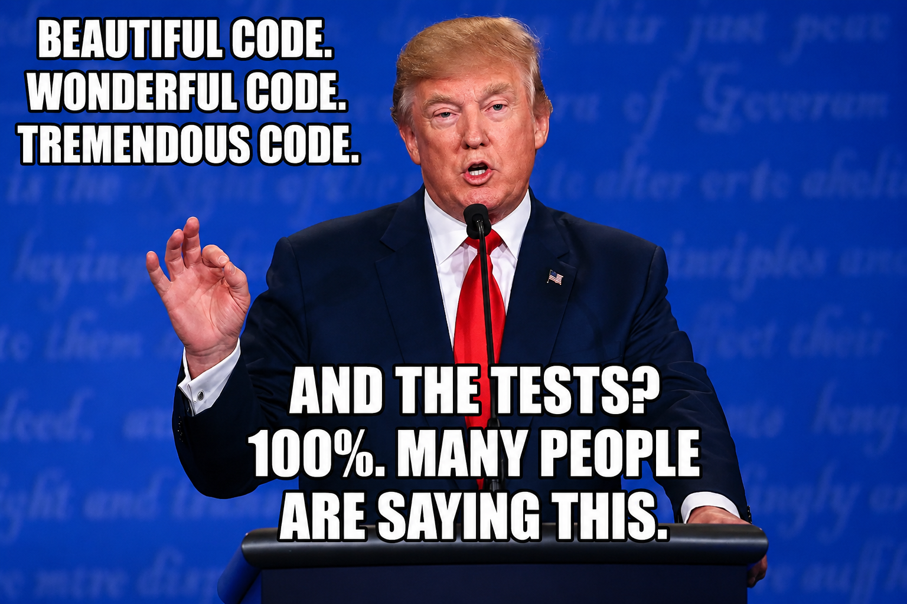

# helhest-stack

<p align="center">
  
</p>

The on-robot navigation stack for the **Helhest Junior** skid-steer robot with the **Odin** dToF
sensor: it maps and plans on the GPU, built on [NVIDIA Warp](https://github.com/NVIDIA/warp).
One importable package, `helhest`, plus one ROS 2 node, `navigation_node`, that runs it on the robot.

Everything is **device-resident by default**: point clouds, grids and rollouts live on the GPU, and
host-device round trips are the exception, not the rule (see `CLAUDE.md`).

## One frame on the robot

`ros/helhest_stack_ros/helhest_stack_ros/navigation_node.py`, `_process` then `_plan`:

| step | what | where |
|---|---|---|
| scan in | self-filter, outlier filter | `perception/cloud_ops.py` (`ScanPreprocessor`), `perception/outlier/` |
| localise | Odin's on-device SLAM pose, taken as is | `/odin1/odometry` |
| map | the scan folded into a probabilistic elevation belief (height, measurement sd, pose drift) | `perception/belief_frame.py` over [`elevation_belief`](https://github.com/aleskucera/elevation_belief) |
| which way | a coarse, world-anchored cost-to-go over pooled blocks | `planning/coarse.py` |
| how | the robot's settle at every pose, read as margins in sigmas, classified and value-iterated; near walls a clearance speed law prices the route in time | `planning/settle_producer.py`, `planning/terrain_value_field/`, `planning/costtogo.py`, `planning/clearance.py` |
| drive | GPU MPPI following the cost-to-go, then a speed governor and the command chain | `control/mppi.py`, `control/governor.py`, `control/command.py` |

All planner settings come from one place, `helhest.planner_config`, for the node and the simulator
alike; the robot's values are in `ros/config/odin.params.yaml`.

## Layout

| path | what |
|---|---|
| `src/helhest/perception/` | scan preprocessing, the outlier filter, inpainting, the belief frame |
| `src/helhest/planning/` | `terrain_value_field/` (the cost-to-go library: margins, control sets, value iteration, two-layer seeding), `settle_producer.py`, `costtogo.py`, `coarse.py`, `clearance.py` |
| `src/helhest/control/` | MPPI, the clearance governor, the command chain, the terminal dock |
| `src/helhest/engine/` | the robot model the planner rolls out and settles (below) |
| `src/helhest/grid.py`, `dynamics.py`, `planner_config.py`, `worlds.py` | the shared grid, the canonical robot/solver params, the plan config, the stress worlds |
| `ros/` | `helhest_stack_ros/` (the package: `navigation_node`, the Odin driver launch, RViz configs), `config/` (the robot's params, the follow-me overlay, driver config, recording QoS, the Fast DDS profile), `sessions/` (tmuxinator), `tools/` (recording, calibration, loggers, the dev shell); deployment gotchas in `ros/README.md` |
| `studies/` | measured work: `closed_loop/` (drive_sim, the sim harness), `bag_replay/` (node on real bags + audit), `clearance/`, `planning_refactor/` (golden-field harness), `belief_mapping/`, `calib/`, `dynamic/`, ... each with its README or PLAN |
| `tests/` | pytest suite; `tests/engine/*.py` also hold standalone parity oracles, which `tests/engine/test_selftests.py` runs |
| `docs/` | `field/` (calibration runbook and results), `incidents/`, `engine/` (Chrono pre-registrations, engine report), `design/`, `research/`, and standalone notes |
| `demos/`, `scripts/`, `benchmarks/` | older demos, one-off scripts, timing benchmarks |

## The engine: a differentiable robot twin

A rigid tripod resolved quasi-statically: `(x, y, yaw)` driven by the three wheels through
skid-steer kinematics with friction-dependent turning (`alpha = 1 + K_TURN * mu`), and
`(z, pitch, roll)` from a settle against the heightmap -- an analytic 3x3 Newton solve with the
wheels grounded, belly clearance checked afterwards (a high-centred pose is rejected, not lifted).
The planner reads that settle at every pose for feasibility, and MPPI rolls it out thousands of
times per frame (`ForwardSimulator`, one fused graph-capturable kernel).

It is differentiable w.r.t. the raw heightmap and the friction field through a hand-written
implicit (IFT) adjoint of the settle (`DifferentiableSimulator`, for calibration). Wheels are
cylinders in the planner (`plan_wheel_width` 0.1 m); `dynamics.robot_params()` without a width
still builds the older sphere envelope.

## Install

```bash
uv sync                              # core: numpy, warp-lang, elevation-belief (git, ssh)
uv sync --extra viz --extra data     # + viewers and the rosbag loader
```

ROS runs inside the helhest Apptainer container (`exec.sh` + `ros/tools/dev-shell.sh`), with no colcon
workspace needed; see `ros/README.md`.

## Run

```bash
# the node on a recorded bag, headless, with the planner's frame history recorded
studies/bag_replay/run_bag.sh bags/in_speed_odin0 out/in_speed.npz 0.5
python studies/bag_replay/audit.py out/in_speed.npz

# the node on a bag with RViz (tmuxinator session, symlinked into ~/.config/tmuxinator)
BAG=/path/to/bag tmuxinator start odin-demo

# closed loop in the ostrich simulator (dasenka): studies/closed_loop/README.md
python studies/clearance/run.py --world slalom --out out/slalom.npz

# tests, and the cost-to-go's bit-identical golden fields
python -m pytest -q
python studies/planning_refactor/golden.py check

# engine parity oracles and timing
python -m tests.engine.step
python -m tests.engine.gradients
python -m benchmarks.planning
```

## License

MIT -- see [LICENSE](LICENSE).
