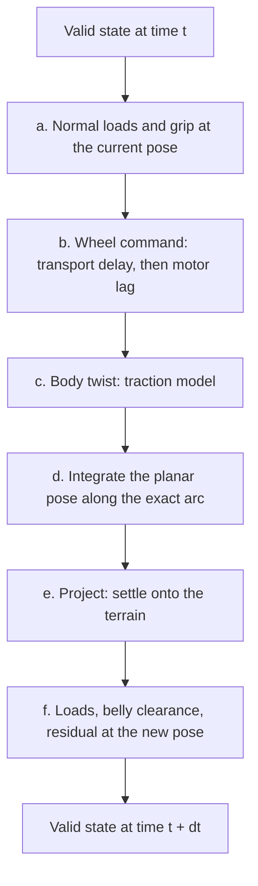

# Physics Modelling of the Helhest Simulation

What `helhest.engine` computes each timestep, and why. The code is `src/helhest/engine/step.py`
(the physics), `robot.py` (geometry and mass), `envelope.py` (the wheel envelope) and
`simulator.py` (the host wrappers). The robot's own configuration is `helhest.dynamics`
(`planning_solver`, `robot_params`), read by the node and `drive_sim` alike. The numbers behind
the defaults are in `docs/field/CALIBRATION_RESULTS.md`, `docs/engine/TIER1_REPORT.md` and the
comments next to each field of `SolverParams` / `RobotParams`.

## 1. Overview and modelling philosophy

The Helhest is a three-wheeled skid-steer vehicle: two driven front wheels on a common axle and a
driven rear wheel on a FIXED axle (not a caster -- confirmed on the robot, 2026-08-10). The input
is the set of commanded wheel angular speeds; the simulator answers *"given these wheel speeds,
where does the body end up, and how does it sit on the terrain?"*

The vertical and the planar parts of the motion are treated differently:

- **Height and tilt are quasi-static.** Terrain contact is stiff and settles far faster than the
  0.1 s control step, so $(z, \theta, \phi)$ are solved as an algebraic equilibrium every step
  rather than time-integrated through a stiff contact spring. No suspension bounce, no airtime.
- **The planar motion has the dynamics that matter at 1-2.5 m/s.** The wheels lag their command
  (a measured first-order actuator), the body's forward speed is a state that grip can only change
  so fast, and gravity pulls along a slope. Rigid-body YAW inertia is not modelled on the default
  path: $\mu m g b / I_{zz} \approx 30\ \text{rad/s}^2$ settles in about 0.03 s, a third of one
  step, and a fitted yaw lag was refuted on the robot (see §4c).
- **Rollouts must be cheap and stable.** Thousands of candidates per planning cycle run in one
  fused kernel (`rollout_kernel`, one thread per rollout, state in registers); the calibration
  simulator keeps a per-step, differentiable path (`DifferentiableSimulator`, an implicit adjoint
  of the settle).

Each timestep is **predict then project**: predict the new planar pose from the wheel motion, then
project it onto the terrain to recover a resting configuration.

$$
\text{valid state} \;+\; \text{wheel command} \;\longrightarrow\; \text{valid state}.
$$

## 2. State and reference frames

Body frame: $X$ forward, $Y$ left, $Z$ up; yaw counter-clockwise. Orientation is the intrinsic
Z-Y-X rotation

$$
R(\psi, \theta, \phi) = R_z(\psi)\,R_y(\theta)\,R_x(\phi),
$$

with yaw $\psi$, pitch $\theta$, roll $\phi$. **Nose-up pitch is negative**: a positive rotation
about $+Y$ tilts the forward axis toward $-Z$, so climbing is $\theta < 0$.

The six pose DOF split into two groups:

- **Controlled** $(x, y, \psi)$ -- what the wheels drive (`controlled` in the code).
- **Terrain-derived** $(z, \theta, \phi)$ -- fixed by gravity and three-wheel contact (`derived`).

Carried between steps as well: the realised wheel speeds $\omega$ (the actuator state) and the
body twist $(v_x, v_y, \omega_z)$ (the momentum state).

Robot constants (`RobotParams`): wheel radius 0.35 m, tread 0.10 m, half track $b = 0.365$ m,
rear wheel 0.75 m behind the front axle, mass 106.2 kg with the CoM at $x = -0.198$ m, and
$I_{zz} \approx 10.1\ \text{kg m}^2$, all derived from one mass table. The CoM sits at axle
height ($z = 0$), which understates slope load transfer for a real chassis; the planning
envelope's tilt limits are set below the simulator's for that reason.

## 3. Terrain representation

Two surfaces derived from the height field $h$:

- **Raw elevation** -- the ground itself. Used only for the belly clearance, because the flat
  underside meets the actual ground.
- **Wheel envelope** -- the ground dilated by the wheel's shape, so each wheel can be treated as
  its hub sitting on a smooth surface. A wheel on rough ground rests on the highest nearby point,
  not on the point under its hub; the dilation builds that in and guarantees a wheel never sinks
  into a bump it would ride over.

The wheel is a **cylinder** by default (`wheel_width` 0.10 m). Along the direction of travel it
presents the full circle; across it, only the half tread $w = 0.05$ m. With $u$ the offset along
travel and $v$ across it, relative to the hub at heading $\psi$,

$$
H_\text{env}(p) \;=\; \max_{|u| \le R,\ |v| \le w}
\Big[\, h(p + \delta) + \sqrt{R^2 - u^2}\,\Big] \;-\; R .
$$

Unlike a sphere this depends on the heading, so the simulator keeps a stack of envelopes, one
per yaw bin: 32 bins over $[0, \pi)$ (a cylinder at $\psi$ and $\psi + \pi$ has the same
footprint). Each step reads the slice for the current heading. The sphere
(`wheel_width=None`, the whole disk of radius $R$) is kept as a fallback and is what the
differentiable path uses. It reaches 0.35 m sideways against the real 0.05, so a rock beside the
wheel lifts the robot where the real wheel straddles it.

## 4. The per-timestep loop

Before a rollout starts, the start pose is settled: $z_0 = H_\text{env}(x, y) + R$, then the
Newton solve of §4e from $(z_0, 0, 0)$.

### (a) Normal loads and grip at the current pose

The per-wheel normal loads $N_i$ come from quasi-static equilibrium under gravity: a 3x3 solve of
one force balance and the two horizontal torque balances about the CoM. Two things make it right
on a slope, both checked against Project Chrono (`docs/engine/PREREG_chrono.md`):

- **The tangential reaction is included.** What holds the robot on a slope is an in-plane friction
  force acting at the ground, below the CoM, and it carries a moment. With the closure that
  friction is shared in proportion to load, $f_i = (N_i / S)\,F_t$ with $S = \sum N_i$, the total
  tangential force follows from force balance, $F_t = m g\,\hat z - S\,\bar n$, and its moment is
  linear in $N_i$, so the solve stays 3x3. Without it the load split was off by 0.249 $mg$ at 25
  deg of pitch, and a side slope produced no left/right transfer at all.
- **The force balance is resolved along the mean normal** $\bar n$, giving
  $S = m g\,\bar n_z = m g \cos(\text{tilt})$, which Chrono confirms to 1e-4; a vertical balance
  of normals alone gives $m g / (\cos\theta \cos\phi)$, 22% over the truth at 25 deg of pitch.

On flat ground both reduce to the plain barycentric split.

The contact point of each wheel is its support point toward $-\hat n$. For the cylinder that is
the rim, $c_i - R\,\hat n_\perp/|\hat n_\perp| - w\,\mathrm{sgn}(\hat n\cdot\hat a)\,\hat a$, with
$\hat a$ the spin axis; it stays in the wheel's plane plus at most the half tread, where the
sphere's contact slid 6.9 cm off the mid-plane at 11 deg of lateral tilt.

Each wheel's grip weight combines its load with the friction coefficient sampled one wheel
radius down the surface normal from the hub, $g_i = \mu_i N_i$, from which the turning
parameters are

$$
x_\text{ICR} = \frac{\sum_i g_i\, x_i}{\sum_i g_i},
\qquad
\alpha = 1 + k_\text{turn}\,\frac{\sum_i g_i}{m\,g}.
$$

$x_\text{ICR}$ is the grip-weighted centroid the body rotates about (less rear grip pulls it
forward and lets the rear kick out). $\alpha \ge 1$ widens the effective track: more total grip
resists the lateral scrub a turn needs, so the same wheel difference yields less yaw. On uniform
flat ground $\alpha = 1 + k_\text{turn}\,\mu$. $k_\text{turn}$ is a SURFACE property: 0.6 on
indoor floor and flat tarmac, 1.0 on grass/dirt; the robot runs 1.27, measured on the vehicle
alone once the drivetrain's own loss of turn differential was separated out
(`ros/config/odin.params.yaml`).

### (b) The wheel command: transport delay, then motor lag

The wheels act on the command issued `command_delay` ago (quantised to whole steps; the measured
dead time is 0-50 ms, which rounds to zero steps at $\Delta t = 0.1$ s). The realised wheel speed
then follows the command through a first-order lag, stepped exactly:

$$
\omega \leftarrow \omega + \big(1 - e^{-\Delta t/\tau}\big)\,(\omega^\star - \omega),
\qquad \tau = 0.19\ \text{s (measured)}.
$$

The exact form matters at the planner's step: at $\Delta t = 0.1$ the linear $\Delta t/\tau$
would make the modelled wheels about a third more responsive than the fitted ones. $\tau = 0$
recovers instantaneous speed sources.

### (c) The body twist: the traction model

Two models; the first is what the robot plans with.

**Kinematic, grip-limited (default).** Differential drive on the front pair, with the turn
attenuated by $\alpha$ and a lateral drift from rotating about an offset ICR:

$$
v_x^\text{cmd} = \frac{R(\omega_L + \omega_R)}{2},
\qquad
\omega_z = \frac{R(\omega_R - \omega_L)}{2\,b\,\alpha},
\qquad
v_y = -\,x_\text{ICR}\;\omega_z .
$$

The rear wheel does not enter the twist; it is consistent when driven at the front average.

With `momentum` on (the default in `planning_solver`), forward speed is a state rather than the
command. Gravity pulls along the body axis, $a_g = g \sin\theta$ (climbing decelerates), and
traction can supply at most $a_\text{lim} = \sum_i g_i / m$:

$$
a_\text{trac} = \mathrm{clamp}\!\left(\frac{v_x^\text{cmd} - v_x^\text{prev}}{\Delta t} - a_g,\;
-a_\text{lim},\; a_\text{lim}\right),
\qquad
v_x = v_x^\text{prev} + (a_\text{trac} + a_g)\,\Delta t .
$$

This makes braking and launch distances depend on $\mu$ (you cannot stop on ice), and on a slope
steeper than $\arctan\mu$ the robot slides whatever it is commanded. The yaw rate stays kinematic.
A first-order yaw lag (`yaw_tau`, or its distance-keyed form `yaw_relax_len`) was tried to explain
Chrono's over-rotation on hard turns and was **refuted on the robot**: once the measured wheel
speeds are used, the body's yaw follows them with no further lag. Both stay at 0 as a documented
negative.

**Shear traction (opt-in, `shear_lk > 0`).** The twist is solved from a force and moment balance
instead of being prescribed. Each contact slips at $s_i$ = (body velocity at the contact) -
(driven rim speed); the ground opposes it with a force that grows along the Janosi-Hanamoto shear
curve instead of jumping to $\mu N$:

$$
\lambda_i = \frac{|s_i|}{|R\,\omega_i|}\,\frac{L}{K},
\qquad
F_i = \mu_i N_i \left(1 - \frac{1 - e^{-\lambda_i}}{\lambda_i}\right)\frac{-s_i}{|s_i|},
$$

with $L/K$ the contact length over the shear modulus (fitted from bags at 8-15; soils put it at
3-15). A contact-patch term adds torsional resistance to spin; rolling resistance (0.09 of the
normal load, measured from wheel torque) opposes each contact's travel over the ground, and is
what reproduces the measured forward gain of ~0.92; gravity's in-plane component and the
centripetal term close the balance. The unknown is $(v_x, v_y, \omega_z)$, solved by a fixed
number of damped Newton steps with a backtracking line search, warm-started from the kinematic
twist. With `body_momentum` the balance also carries $m(v - v^\text{prev})/\Delta t$ and
$I_{zz}(\omega_z - \omega_z^\text{prev})/\Delta t$, implicitly: the contacts' time constants
(about 20 ms translational, 8 ms in yaw) would force an explicit scheme down to $\Delta t \approx$
5 ms. Here $\alpha$ and $x_\text{ICR}$ are outputs, reported for diagnostics. It is opt-in because
over all turning samples in the bags both models fit equally well (RMS ~0.16 rad/s): yaw
transients dominate the error, not the traction law.

### (d) Integrate the planar pose along the exact arc

The body twist is rotated into the world through the current full orientation,
$\dot{\mathbf{x}}_\text{world} = R(\psi,\theta,\phi)\,(v_x, v_y, 0)^\top$, and the planar pose is
advanced along the **exact arc** of a constant twist, not a forward-Euler chord. With
$\Theta = \omega_z \Delta t$ and the world velocity $(u_x, u_y)$ expressed in the frame of the
current heading,

$$
\Delta\mathbf{x}_\text{local} =
\begin{pmatrix} \frac{\sin\Theta}{\omega_z} & -\frac{1 - \cos\Theta}{\omega_z} \\[2pt]
\frac{1 - \cos\Theta}{\omega_z} & \frac{\sin\Theta}{\omega_z} \end{pmatrix}
\begin{pmatrix} u_x \\ u_y \end{pmatrix},
\qquad \psi \leftarrow \psi + \Theta,
$$

rotated back into the world by $\psi$. It tends to the Euler update as $\omega_z \to 0$, where a
small-angle branch avoids $0/0$. Euler landed 10-19 cm off the arc over a 2.5 s horizon at
2.1 m/s (`tests/engine/integrator.py`); the arc is exact for a constant twist at any $\Delta t$.

Rotating through pitch and roll is what makes climbing slow horizontal progress: part of the
forward wheel motion goes into height, with no separate slope-drag term.

### (e) Project: settle onto the terrain

With $(x, y, \psi)$ fixed, $(z, \theta, \phi)$ are found by requiring each wheel hub to rest on
the envelope slice for the new heading:

$$
c_i(z, \theta, \phi) = z_{\text{hub},i} - H_\text{env}(x_{\text{hub},i},\,y_{\text{hub},i}) - R = 0,
\qquad i = 1, 2, 3 .
$$

Three equations in three unknowns: a three-point stance has a unique resting attitude, with no
statically indeterminate rocking. The solve is Newton with an ANALYTIC Jacobian (the rotation
derivatives applied to each wheel, combined with the envelope's gradient under it), warm-started
from the previous attitude, each step clamped per DOF and the tilt clamped (60 deg for planning,
69 deg for the driven robot). It
stops early below `atol`.

### (f) Diagnostics at the new pose

The step writes, for the planner and the tests to judge:

- the **normal loads** at the settled pose (§4a again);
- the **belly clearance** -- the minimum over a grid of points under both chassis boxes of
  $z_j - h(x_j, y_j)$, against the RAW terrain (a grid, so an obstacle under the middle of the
  belly is caught, not only one under a corner);
- the **settle residual** $\max_i |c_i|$ -- nonzero when no resting pose exists (a wheel over a
  drop, a pose the three-point stance cannot reach).

The engine itself flags nothing. The planner reads these through `planning/settle_producer.py`:
the residual against `resid_tol` (1e-2) is a HARD constraint, the belly clearance against
`clear_margin` (0.05 m) and the tilt against the planning envelope (roll 30 deg, nose-down 25,
nose-up 45; set below what the simulated robot survived when driven onto a ramp until it went
over, `studies/envelope/`) are soft margins.

## 5. Two solver fidelities

`dynamics.planning_solver()` runs the MPPI rollouts: at most 6 Newton iterations to `atol` 1e-4
(0.1 mm, a hundred times inside the validity gate; a warm-started settle needs about two), the
measured motor lag and momentum. `dynamics.execution_solver()` settles the single driven robot:
12 iterations to 1e-6 (the tight default exists for the implicit adjoint of the calibration path,
which assumes the residual is zero at the root). Both share $\Delta t = 0.1$ s and the turn gain,
so the plan and the driven robot are the same vehicle.

## 6. Assumptions and limitations

- **Quasi-static in the vertical.** No suspension, no contact dynamics, no airtime; all three
  wheels are assumed in contact. A pose where one lifts off shows up as settle residual.
- **Rigid wheels and rigid ground.** Wheel-terrain interaction is geometric, through the envelope.
  Soil deformation (Chrono's SCM runs) is outside the model.
- **No yaw inertia on the default path** (§1, §4c); the shear model with `body_momentum` has it.
- **Friction is a per-cell field** sampled at each contact, but on the robot it is uniform
  (`set_uniform_friction`): one $\mu$ for the whole map, optionally recentred online from the
  realised turn gain (`plan_mu_adapt`). Nothing estimates it per cell.
- **CoM at axle height** (§2): slope load transfer is understated for the real chassis; the
  planning limits carry the margin.
- **The differentiable path uses the sphere envelope**: the taped settle has no yaw index, so
  `DifferentiableSimulator` runs with `wheel_width=None`.
