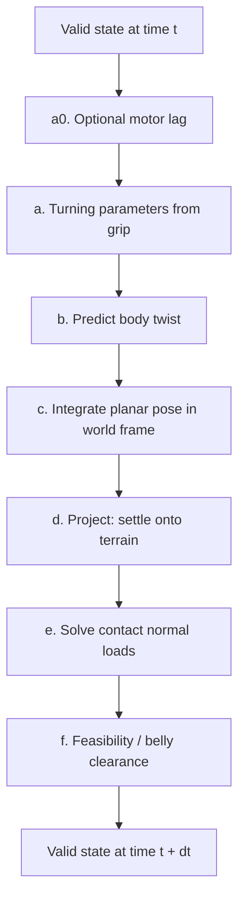

# Physics Modelling of the Helhest Simulation

## 1. Overview and modelling philosophy

The Helhest is a three-wheeled skid-steer vehicle: two front wheels on a common
axle and a single trailing rear wheel. The simulation is a **quasi-static
kinematic twin**. The command driving the vehicle is the set of wheel angular
speeds; the simulator's job is to answer *"given these wheel speeds, where does
the body end up, and how does it sit on the terrain?"*

We deliberately do **not** integrate a full rigid-body dynamics model (forces,
inertia, motor torques, tyre slip evolving in time). The reasons:

- **Separation of timescales.** Terrain contact is stiff and settles far faster
  than the control step. Over one control interval the body height and tilt are
  effectively slaved to the ground, so it is more faithful (and far cheaper) to
  solve them as an *algebraic* equilibrium each step than to time-integrate a
  stiff contact spring.
- **The command is kinematic.** The vehicle is speed-controlled at the wheels,
  not torque-controlled, so a kinematic model already captures the dominant
  input-output behaviour.
- **Planning needs cheap, smooth, stable rollouts.** A quasi-static model does
  not blow up under large steps, which matters when thousands of candidate
  trajectories are simulated per planning cycle. The fused MPPI rollout is
  forward-only; the separate calibration simulator keeps the differentiable
  per-step path.

The trade-off is that transient dynamics (suspension bounce, wheel spin-up,
dynamic weight transfer during acceleration) are not represented.

The central invariant of the loop is

$$
\text{valid state} \;+\; \text{wheel speeds} \;\longrightarrow\; \text{valid state},
$$

realised as a two-phase **predict then project** update every timestep: predict
the new planar pose from the wheel motion, then project that pose back onto the
terrain to recover a physically consistent resting configuration.

## 2. State and reference frames

The body frame has $X$ forward, $Y$ to the left, and $Z$ up, with yaw measured
counter-clockwise. Body orientation relative to the world is the intrinsic
Z-Y-X rotation

$$
R(\psi, \theta, \phi) = R_z(\psi)\,R_y(\theta)\,R_x(\phi),
$$

with yaw $\psi$, pitch $\theta$, and roll $\phi$. (Nose-up pitch is negative:
a positive rotation about $+Y$ tilts the forward axis toward $-Z$.)

The six pose degrees of freedom are split into two groups, and this split is the
key modelling decision:

- **Controlled planar DOF** $(x, y, \psi)$ — the position and heading in the
  ground plane. These are what the wheels actually drive.
- **Terrain-derived DOF** $(z, \theta, \phi)$ — height, pitch, and roll. These
  are *not* free: gravity and the requirement that all wheels touch the ground
  determine them uniquely from the planar pose.

A **valid state** is one where the controlled DOF have an associated settled,
non-penetrating placement: the three wheels rest on the terrain and the belly of
the chassis clears the ground.

## 3. Terrain representation

The terrain is a height field. The simulation uses **two** surfaces derived from
it, for two physically distinct types of contact:

- **Raw elevation** — the actual ground surface. Used only for chassis (belly)
  clearance, because the flat underside of the body contacts the true ground.
- **Wheel envelope** — the ground surface *dilated* by the wheel's spherical
  cap. A wheel of radius $R$ resting on rough ground touches the highest nearby
  point, not the point directly under its hub. Inflating the terrain by the
  wheel shape lets us treat each wheel as a single point (its hub) sitting on a
  smooth surface at a fixed offset. The envelope height is

$$
H_\text{eff}(p) \;=\; \max_{\lVert q - p\rVert \le R}
\Big[\, h(q) + \sqrt{R^2 - \lVert q - p\rVert^2}\,\Big] \;-\; R,
$$

  where $h$ is the raw height. This is the classic morphological dilation of the
  ground by a sphere: it guarantees a wheel never interpenetrates a bump it
  should have ridden over, and it turns the wheel-placement problem into a
  simple point-on-surface condition.

## 4. Initial settle and the per-timestep loop

Before a rollout starts, the initial controlled pose $(x,y,\psi)$ is projected
onto the terrain. The solver samples the wheel envelope at the start pose for
$z_0 = H_\text{eff}(x,y) + R$, then Newton-solves the terrain-derived
$(z,\theta,\phi)$.

Each control step of duration $\Delta t$ transforms one valid state into the
next. Let the commanded wheel angular speeds be
$\omega^\star = (\omega^\star_L, \omega^\star_R, \omega^\star_\text{rear})$.
With actuator lag enabled, the carried wheel-speed state
$\omega = (\omega_L, \omega_R, \omega_\text{rear})$ is updated first and the
resulting actual speed is used by the kinematic twist. With the default
`tau_motor = 0`, commanded and actual wheel speeds are identical.

### (a0) Optional motor lag

The simulator can model first-order actuator lag between commanded and actual
wheel speed:

$$
\omega \leftarrow \omega +
\min\!\left(\frac{\Delta t}{\tau_\text{motor}}, 1\right)
(\omega^\star - \omega).
$$

The update is applied before the twist calculation. A zero time constant
recovers the original instantaneous speed-source behaviour.

### (a) Turning parameters from grip

Skid-steer vehicles turn by forcing the wheels to slide laterally, so the turn
geometry depends on where the grip is. Each wheel $i$ carries a lateral grip
"weight" combining its friction coefficient $\mu_i$ (sampled at the world
contact point on the wheel envelope, not at the hub) and its normal load $N_i$:

$$
w_i = \mu_i \, N_i.
$$

Two lumped parameters summarise the effect:

$$
x_\text{ICR} = \frac{\sum_i w_i\, x_i}{\sum_i w_i},
\qquad
\alpha = 1 + k\,\frac{\sum_i w_i}{m\,g}.
$$

Here $x_i$ is the longitudinal position of wheel $i$, $m$ the vehicle mass, $g$
gravity, and $k$ a turn-resistance gain.

- $x_\text{ICR}$ is the longitudinal offset of the instantaneous centre of
  rotation. It is the grip-weighted centroid of the wheels: the vehicle rotates
  about wherever the grip is concentrated. Reducing rear grip, for instance,
  pulls the rotation centre forward and lets the rear "kick out".
- $\alpha \ge 1$ is an effective-track-widening factor. More total grip means the
  wheels resist being dragged sideways more strongly, so a given speed
  difference produces *less* yaw. On uniform flat ground this reduces to
  $\alpha = 1 + k\mu$ and $x_\text{ICR}$ at the load centroid.

### (b) Predict: body twist from wheel speeds

The front pair sets the body twist through standard differential-drive
kinematics; the rear wheel is kinematically redundant (consistent when driven at
the front average) and does not enter the twist. With wheel radius $R$ and half
track $b$:

$$
v_x = \frac{R(\omega_L + \omega_R)}{2},
\qquad
\omega_z = \frac{R(\omega_R - \omega_L)}{2\,b\,\alpha},
\qquad
v_y = -\,x_\text{ICR}\;\omega_z.
$$

The forward speed $v_x$ is the mean wheel rim speed. The yaw rate $\omega_z$
comes from the left-right speed difference, attenuated by $\alpha$. The lateral
velocity $v_y$ is the drift induced by rotating about an ICR that is offset
longitudinally from the body origin — a pure kinematic consequence of
$x_\text{ICR} \neq 0$.

### (c) Integrate the planar pose in the world frame

The body-frame twist is rotated into the world through the *current*
orientation and integrated with a forward-Euler step:

$$
\begin{pmatrix} \dot x \\ \dot y \\ 0 \end{pmatrix}_\text{world}
= R(\psi, \theta, \phi)\begin{pmatrix} v_x \\ v_y \\ 0 \end{pmatrix},
\qquad
\begin{aligned}
x &\leftarrow x + \dot x_\text{world}\,\Delta t,\\
y &\leftarrow y + \dot y_\text{world}\,\Delta t,\\
\psi &\leftarrow \psi + \omega_z\,\Delta t.
\end{aligned}
$$

Rotating through the full orientation (including the current pitch and roll) is
what makes climbing naturally slow horizontal progress: when the body is pitched
up on a slope, part of the forward wheel motion goes into gaining height, so the
same $v_x$ projects to a smaller horizontal displacement. No separate "slope
drag" term is needed — it falls out of the geometry.

### (d) Project: settle onto the terrain

With the new planar pose $(x, y, \psi)$ fixed, the three terrain-derived DOF
$(z, \theta, \phi)$ are found by requiring every wheel hub to rest exactly on
the wheel envelope. For each wheel the signed clearance is

$$
c_i(z, \theta, \phi) = z_{\text{hub},i} - H_\text{eff}(x_{\text{hub},i},\,y_{\text{hub},i}) - R,
$$

where the hub position depends on $(z, \theta, \phi)$ through the body
orientation. Setting

$$
c_i(z, \theta, \phi) = 0 \quad\text{for } i = 1,2,3
$$

gives three equations in three unknowns — exactly determined, which is why a
three-wheel vehicle has a unique resting attitude on a surface (a well-posed
"three-point stance", no statically indeterminate rocking). The system is
nonlinear (through the orientation and the terrain shape) and is solved by a
Newton root-find, warm-started from the previous step's attitude because the
pose changes only slightly per step.

### (e) Contact normal loads from quasi-static equilibrium

With the body settled, the per-wheel contact normal loads $N_i$ follow from
static equilibrium under gravity. Let $\hat n_i$ be the terrain normal at
contact $i$ and $r_i$ the lever arm from the centre of mass to that contact.
Balancing the vertical force and the two horizontal torque components about the
centre of mass gives three equations:

$$
\sum_i N_i\, \hat n_{i,z} = m g,
\qquad
\sum_i \big(r_i \times N_i\, \hat n_i\big)_x = 0,
\qquad
\sum_i \big(r_i \times N_i\, \hat n_i\big)_y = 0.
$$

Three contacts and three balance equations again make the problem exactly
determined, so the loads solve uniquely. Only these three equations are enforced
because they are the statically determinate ones: the remaining force and torque
components are carried by tangential friction at the contacts, which a normal-load
balance does not resolve. The vertical-load distribution is what feeds back into
the grip weights $w_i = \mu_i N_i$ of the next step, closing the loop between
weight transfer and turning behaviour — e.g. loading the front wheels on a
downslope shifts the rotation centre forward.

### (f) Feasibility and belly clearance

Finally the configuration is checked for **high-centring**. Sample points across
the underside of the chassis are placed in the world and compared against the
**raw** terrain (not the envelope — the belly meets the actual ground):

$$
c_\text{chassis} = \min_j\big(z_j - h(x_j, y_j)\big).
$$

If $c_\text{chassis}$ is below the configured clearance threshold, the vehicle is
high-centred and the state is flagged invalid. Reference rollouts default this
margin to zero; planner-facing robot parameters use a positive `clear_margin`
default so near-contact poses can be rejected before penetration. A grid of
sample points (rather than just the corners) is used so an obstacle under the
centre of the belly is caught, not only ones beneath a corner.

The final validity gate therefore combines two checks:

$$
c_\text{chassis} \ge \texttt{clear\_margin}
\qquad\text{and}\qquad
\max_i |c_i| \le \texttt{resid\_tol}.
$$

## 5. Assumptions and limitations

- **Quasi-static, per step.** Height and tilt are solved as an instantaneous
  equilibrium; there is no suspension transient or contact dynamics.
- **No dynamic force integration.** Wheel torque, body inertia, and momentum are
  not modelled; horizontal motion is first-order (forward Euler). With
  `tau_motor = 0` the wheels are instantaneous speed sources; with
  `tau_motor > 0` commanded wheel speed is filtered by the first-order actuator
  lag state.
- **Friction enters only through turning.** Contact friction shapes the
  turn geometry via $(\alpha, x_\text{ICR})$; there is no explicit longitudinal
  slip or traction-limit model.
- **Static determinacy from three contacts.** Both the attitude solve and the
  load solve rely on the three-wheel contact being exactly determined; the model
  assumes all three wheels remain in contact (a wheel lifting off is outside the
  settled regime).
- **Rigid terrain and rigid wheels.** Ground and wheels do not deform; wheel-terrain
  interaction is captured purely geometrically through the spherical-cap
  envelope.
- **Simplified centre of mass height.** The default mass model uses the measured
  longitudinal centre of mass but keeps `CoM_z = 0`, so slope load transfer does
  not include a raised body mass unless the robot parameters are changed.
- **Two solver fidelities.** `planning_solver()` uses fewer Newton iterations
  and a looser tolerance for thousands of MPPI rollouts; `execution_solver()`
  uses the deeper settle for the single driven robot.
